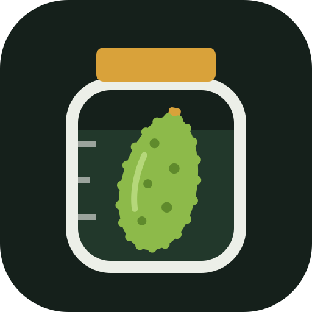

<p align="center"></p>

# Kantar

Kantar is a personal weight-loss tracker that runs in the browser. You give it start and end dates
and weights; it draws the schedule between them and helps you stick to a meal plan until you get
there. You log food by photo, by typing, or with one tap on a planned meal.

It is a single-user web app (PWA) with no backend and no account. You host the files yourself,
add the page to your phone's Home Screen, and your entries are stored on that phone.

"Kantar" is Turkish for a steelyard, the scale with a sliding weight on a graduated beam. The icon
shows one: food in the pan, the weight on the beam, the two in balance.

## What it does

- **Today:** the week as seven day circles with your streak; the day's calories as a budget that
  burns down over the day, with the plan's pace beside it and a forecast for where the day will
  end; weight against the schedule, protein, the meals of the day with a suggestion for the next
  one, steps, water and the week's treats. Five daily goals (weigh-in, calories, protein, steps,
  water) make a perfect day.
- **Log:** what you sent on your last 60 days with entries, one line per entry. Take a photo, choose photos from
  the library, or type. A model estimates calories and macros and lists each item with its amount
  and calories, including what it had to assume ("falafel (assumed fried)"). Tell it in a few words
  what the photo does not show and it revises the items; you can also correct the portion, the
  numbers or the time. Every day with a logged meal carries a review. The verdict is worked out on
  the device (in line, mostly in line, under target, slightly over, set you back) and, for a surplus,
  what it costs on the schedule, at 7,700 kcal to the kilo ("491 kcal over target: about 0.06 kg,
  69% of what the day was meant to lose"). The model then writes a short note on what helped, what
  cost the most and what would have reduced it, and one thing to do next.
- **Check:** a verdict before you order or buy. Photograph a restaurant menu, a dish, or a product
  and its nutrition table (up to four photos, or just a typed question). A model rates each option's
  quality in general, says whether it fits your plan and what is left of today, estimates calories
  and protein for a portion, and tells you how to order it so that it fits or what to have instead.
  One tap logs the option you chose.
- **Progress:** one marker for every kilo collected, streaks and perfect days, the weight chart with
  a 7-day average, projected arrival date, a consistency calendar and checkpoints.
- **Plan:** every meal option as a card with a picture, its ingredients and amounts one tap away,
  and the rules of the plan. The pictures are your own photos: add one from the meal's card, or let
  the first logged photo that matches a plan meal fill it in. Every picture gets the same treatment,
  so the plan looks like one set: you frame the plate in a circle, and light, colour and contrast are
  evened out.

Things that never need a model, and so cost nothing: planned meals, favourites, weight, steps,
water and workout days. Typing `85.4`, `8200 steps`, `water 2 glasses` or `workout` is understood
on the device.

## Privacy and data

- Entries, photos and settings are stored in the browser's IndexedDB on your device. Nothing is
  sent to a server of this project, because there is none.
- Photo and free-text analysis goes straight from your phone to the model provider you choose,
  with your own API key. That is the one place your data leaves the device: the photos and text you
  send, with the time of the entry. The provider and your static host also see your IP address.
  Logged photos are downscaled to 768 px before they are sent.
- Photos are never stored as taken. Logged photos are kept as a 768 px copy, plan pictures as a
  640 px framed and colour-corrected one. Both are re-encoded, so the stored file carries no
  location, capture time or camera details. The capture time is read once, to time the entry.
- The day's review sends text only: that day's meals with their numbers, steps, water, weigh-in,
  your targets, the weight schedule and where you stand against it. No photos.
- Photos taken for a check are sent at up to 1536 px, so small print stays readable, together with
  where your day stands. They are not stored; the last 30 verdicts are, as text.
- The API key is stored on the device only, unencrypted like the rest of the app's data, and is
  never written to a backup file.
- Photo location is off by default. When on, it is read on the device and matched to places you
  saved; the model only receives a label such as "Home" or "out", never coordinates.
- There is no sync. Back up from Settings → "Backup and export"; the backup is a JSON file you can
  restore on the same or another device. It holds your entries, targets, favourites, the plan's
  pictures, the verdicts of your checks and your saved places with their coordinates. Photos of
  logged meals are included only when you choose "With photos". Restoring adds the backup's
  entries, days, checks and plan pictures to what is on the device (an entry or day that is in
  both takes the backup's version); its targets, favourites and saved places replace yours. The
  provider, address, model and key stay as they are.

## Get your own copy

1. Fork this repository, or push the files to a repository of your own. There are no secrets in
   the code, so it can be public.
2. Serve it over HTTPS from any static host. With GitHub Pages: repository → Settings → Pages →
   "Deploy from a branch", `main` / `(root)`. The app is then at `https://<user>.github.io/<repo>/`.
   All pages under one `<user>.github.io` share the same browser storage, your API key included, so
   host nothing else there, or use a custom domain for this app.
3. Open that address on your phone and add it to the Home Screen (on iPhone: Share → Add to Home
   Screen). The app then opens full screen and works offline.
4. Open Settings (top right) → Targets and enter your own dates, weights and daily targets.

The app is built for and used on an iPhone. Other modern mobile browsers should work but have
had less testing.

## Photo and text analysis

Optional. In Settings → "Photo and text analysis", choose a provider and enter your key:

- **OpenAI-compatible endpoints:** presets for Google Gemini (has a free tier), OpenCode (Zen and
  Go) and OpenRouter, or any `https://` base address and model you type in. "Save and test" checks
  both text and photo input; "find a model that reads photos" tries the provider's models one by one.
- **Claude:** an Anthropic API key from https://platform.claude.com, which needs prepaid credit.
  Haiku 4.5 is the default; Sonnet 5.5 can be chosen in Settings and is used by "Analyse again with
  Sonnet". Settings shows the calls made and, for Claude, their estimated cost.

If the provider is busy, the app retries twice and, where a preset lists other models (only Gemini
does), tries those. A request that takes longer than a minute is given up on. If it still fails,
the entry waits and is analysed later: when you open the app, when the connection comes back, or
when you tap Analyse. After a failure that every request would share (no quota, a wrong key, no
connection) the waiting entries pause instead of each sending a request. Nothing you sent is lost.
A failed new estimate never replaces an earlier one.

The last finished day (looked for up to three days back) is reviewed by itself when you open the
app or come back to it, if enough is logged: one short text request a day. Any other day, including
today so far, is reviewed when you ask for it in the Log. The automatic review can be switched off
in the same Settings section; the verdict from the numbers needs no model and is always shown.

Estimates from a photo are rough. Treat them as a starting point and correct the portion when
it is off.

## Make it your plan

The repository ships with one example plan: about 1,550 kcal on rest days and 1,750 kcal on
workout days, 135 g of protein, lunch at 12:00, two snacks, dinner at 18:00.

- **Targets** (dates, weights, calories, protein) are changed in the app under Settings → Targets.
  Daily calories below `KCAL_FLOOR` (1,500) are refused, as the plan's rules say. The goals for
  steps, water and fibre come from `DEFAULTS` in `js/plan.js` and apply only before the app is first
  opened on a device.
- **Meals and rules** live in `js/plan.js`:
  - `FOODS`: nutrition per 100 g, as `[kcal, protein, carbs, fat, fibre]`.
  - `TEMPLATES`: the meal options. Each has an id, a slot and a list of `[food, grams, measure]`.
    Calories and macros are computed from the food table, never typed by hand.
  - `SLOTS`: the meals of the day and their times.
  - `FLEX`: one-tap treats that count against the weekly budget.
  - `RULES`: the text shown on the Plan tab.
  - `DEFAULTS`: targets used before anything is saved in Settings.

  The model receives a short digest of the plan with every request, so it follows your changes
  to meals and foods without further setup. Two things are not generated from the file: the numbers
  in `RULES` come from `DEFAULTS`, `KCAL_FLOOR` and `SMALL_TREAT_KCAL`, not from what you saved in
  Settings → Targets, so keep them in step; and the meal slots are also named in `SLOT_NAME`,
  `slotByTime`, the prompt in `js/ai.js` and the notes on the Plan tab in `js/views.js`, so
  changing the slots means editing those too.

The app uses kilograms, kilocalories and English (`en-GB` number and date formats).

## Export to SQLite

Settings → "Backup and export" → "Export for SQLite" saves one `.sql` file. It is plain text that
creates the tables and fills them, so any SQLite tool can load it:

```sh
sqlite3 -bail kantar.db < kantar-export-2026-10-12.sql
```

`-bail` stops at the first error, so a failed load is rolled back. Loading a newer export into the
same database replaces the `kantar_*` tables and the view, with anything you added to them, and
leaves everything else in that database alone.

| Table or view | One row per | Columns |
|---|---|---|
| `kantar_days` | day | `day`, `weight_kg`, `steps`, `water_ml`, `workout`, `target_kcal`, `target_weight_kg` |
| `kantar_meals` | logged meal | `id`, `day`, `logged_at`, `slot`, `title`, `source`, `plan_id`, `tier`, `status`, `portion`, `kcal`, `protein_g`, `carbs_g`, `fat_g`, `fibre_g`, `confidence`, `place`, `note`, `photos`, `flags` |
| `kantar_meal_items` | ingredient of a meal | `meal_id`, `position`, `name`, `grams`, `kcal`, `protein_g` |
| `kantar_settings` | setting | `key`, `value` (dates, weights, daily targets, and the export's own version and time) |
| `kantar_daily` (view) | day | the day's values, the 7-day weight average, and the meal totals |

Calories, macros and grams are already multiplied by the portion. Only meals with `status = 'ok'`
have numbers. `target_kcal` and `target_weight_kg` are worked out from your current Targets, so
changing them changes past rows. Photos, API keys and the coordinates of saved places are not
exported.

```sql
-- weight against the schedule
SELECT day, weight_kg, weight_avg7_kg, target_weight_kg FROM kantar_daily ORDER BY day;

-- days over the calorie target
SELECT day, kcal, target_kcal FROM kantar_daily WHERE kcal > target_kcal;

-- what was off plan, and how much it cost
SELECT day, title, kcal FROM kantar_meals WHERE tier = 'off' AND status = 'ok' ORDER BY kcal DESC;
```

The export is for analysis. To move or restore the app's data, use the JSON backup.

## Development

There is no build step and there are no dependencies: plain HTML, CSS and JavaScript modules.

```sh
python3 -m http.server 8770
# then open http://localhost:8770/
```

The service worker serves the app from a versioned cache, so after the first load your edits do
not show up until you either bump the version (see below), use Settings → "Version and updates" →
"Clear cache and reload", or bypass the service worker in the browser's developer tools.

Tests need Node 22 or later and no dependencies:

```sh
node --test
```

They cover the calculations (`js/core.js`), the checks on backup files (`js/backup.js`), the model
layer against a mocked `fetch` (`js/ai.js`) and the SQL export, which is loaded into Node's built-in
SQLite and queried as in the section above. The screens and the IndexedDB code are not covered.

On `localhost` the app exposes `window.__kantar` for debugging.

## Releasing an update

Bump `VERSION` in `sw.js` (`'kantar-v20'`) and `APP_VERSION` in `js/core.js` (`'20'`) together, then
deploy. List a file you add in `SHELL` in `sw.js` so the first launch works offline; a listed file
that does not exist makes the install fail. Installed
copies find the new version when the app opens or comes to the front, and reload on their own, or,
if something is half-typed or being analysed, show a Reload button. Stored data is kept. The running
version is shown under Settings → "Version and updates".

## Project layout

- `index.html`, `styles.css`, `manifest.webmanifest`: shell, styles and web app manifest
- `js/core.js`: state and the calculations on it (budget, verdicts, weight, streaks). It has no
  DOM and no storage, so it loads in Node and can be tested there
- `js/app.js`: storage, event handling, the analysis queue, backup and restore
- `js/views.js`: the screens
- `js/plan.js`: food table, meal templates, targets, rules
- `js/ai.js`: model calls (Claude and OpenAI-compatible), prompt and output schema
- `js/backup.js`: checks everything read from a backup file before it is stored
- `js/exif.js`: reads capture time and location from a photo
- `js/db.js`: IndexedDB
- `js/picture.js`: the treatment every plan picture gets (framing, white balance, exposure)
- `js/export.js`: the SQL export
- `sw.js`: offline cache and updates
- `icons/`: `icon.svg` is the source; the PNG files are rendered from it for the Home Screen and
  the web app manifest

## Limits

- One user, one device. No sync and no multi-device merge; moving devices means restoring a backup.
  Backups, and data on a device, from the first release (Turkish ids) can no longer be converted;
  version 18 of the app (git commit `68369c1`) still does.
- Browsers can evict web data when storage runs low. Adding the app to the Home Screen makes that
  less likely, and a regular backup covers the rest.
- This is a tracking tool, not medical or dietary advice. The example plan was written for one
  person; check your own targets with a professional if you have a health condition.
