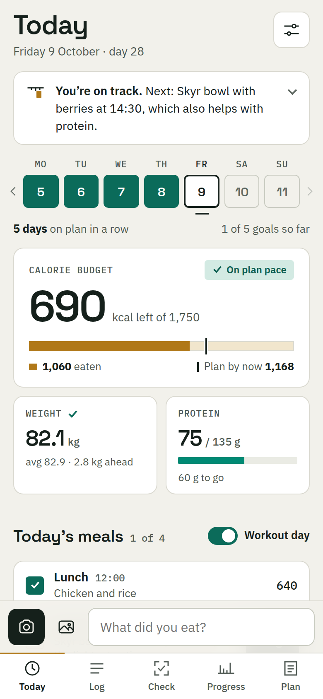
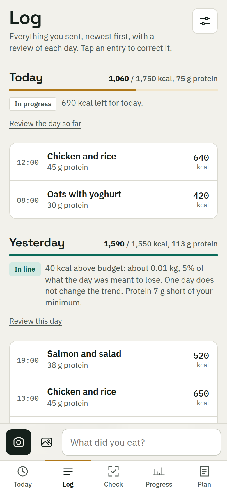
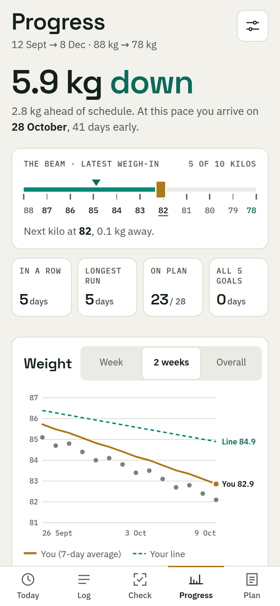

# Pickle

*Good things take time.*

A weight-loss tracker that runs on your phone. Set a start and a goal, and Pickle draws the
line between them. Log what you eat with a photo, a few typed words, or one tap on a planned meal,
and see every day whether you are on that line.

No backend, no account. Your data stays on your device.

 

  
  
  

## What is in it

| Screen | What it does |
|---|---|
| **Today** | What is left of the day's calories, protein, weight, steps, water and the week at a glance |
| **Log** | Every entry, newest first, with a short review of each day |
| **Check** | Photograph a menu, a dish or a product before you order or buy, and get a verdict against your plan |
| **Progress** | Weight against your line, projected arrival date, runs of days on plan, a consistency calendar |
| **Plan** | Your meal options with ingredients, and the rules |

Weight, steps, water, coffee, workouts and planned meals need no model and no key. Type `85.4`,
`8200 steps` or `2 beers`, or tap a planned meal.

## Set it up

1. Fork this repo and serve it over HTTPS from any static host (GitHub Pages: Settings → Pages →
   `main` / `(root)`).
2. Open the address on your phone and add it to the Home Screen. Pickle only runs as an installed app.
3. Open Settings → Goals and enter your dates, weights and daily calories.
4. Optional: add an API key under Settings → "Photo and text analysis" to log by photo.

Built for and used on an iPhone. Other modern mobile browsers should work.

## Read more

- [Photo and text analysis](docs/analysis.md): providers, keys, retries, daily reviews
- [Make it your plan](docs/your-plan.md): meals, foods and rules in `js/plan.js`
- [Privacy and data](docs/privacy-and-data.md): what stays on the device, backup, reset, SQLite export
- [Development](docs/development.md): running, tests, languages, releasing, project layout

## Limits

- One user, one device. No sync; to move devices, restore a backup.
- Browsers can evict web data when storage runs low. Back up regularly.
- Photo estimates are rough. Correct the portion when it is off.
- A tracking tool, not medical or dietary advice. The example plan was written for one person.
